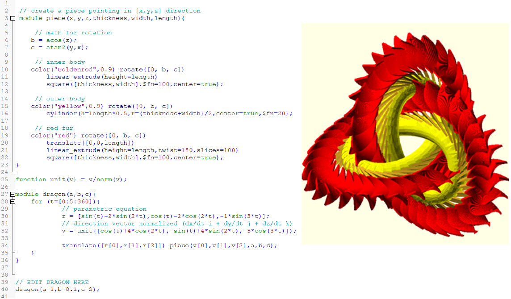

# FunWithOpenSCAD
Create 3D objects using only code with [OpenSCAD](https://openscad.org/)
1. Z-saber
2. Lizard Trap
3. Mobius strip
4. Trefoil dragon ring
   
## Usage
* **STL Folder**: Contains 3D models in .stl file format, which can be opened with any graphic software.
* **OpenSCAD Folder**:  Contains the code for the models, which can be edited with OpenSCAD.
* **detail.pdf**: Contains insight on how to code and how to adjust the parameter for each model
  
## Example

**Base Trefoil dragon ring** 

(May take up to 10 minutes to re-render in OpenScad)

**Trefoil dragon ring with different parametrization**

